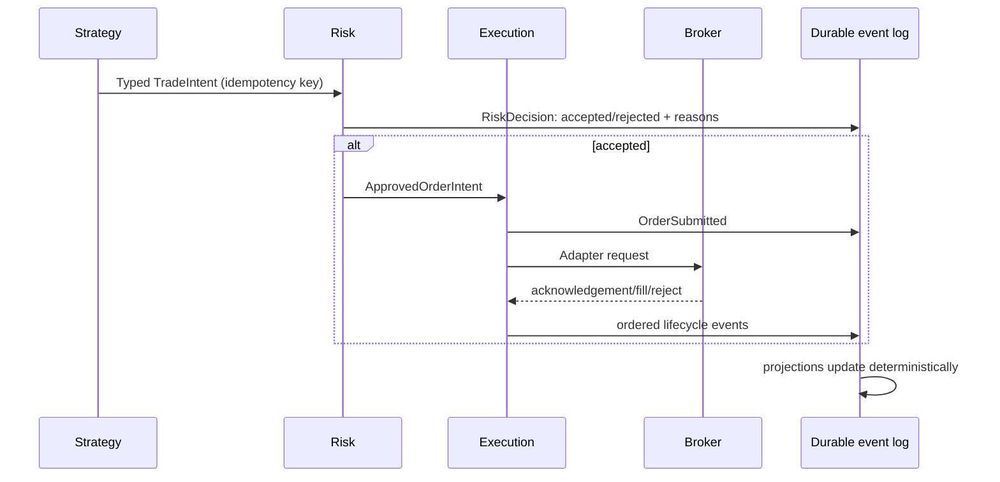
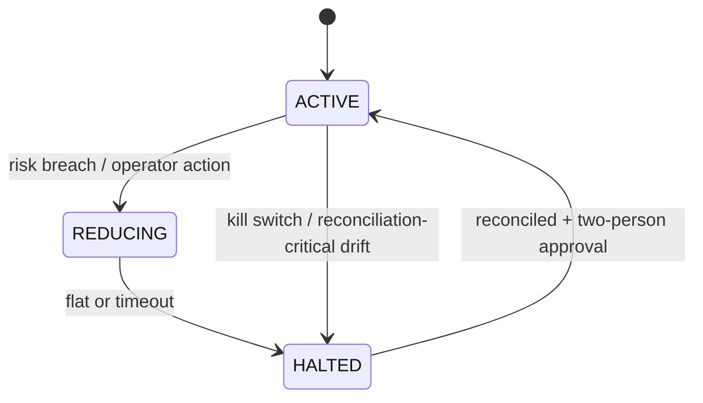

# Project TITAN Architecture

> **Owner:** Core Platform Architecture
> **Status:** Active — v1.0
> **Last Review:** 2026-07-12
> **Decision Authority:** Architecture Council
> **Depends On:** [SYSTEM_CONTRACTS.md](SYSTEM_CONTRACTS.md), [RISK_POLICY.md](RISK_POLICY.md)
> **Supersedes:** None
> **Review Frequency:** Per architecture decision; quarterly otherwise

## Architectural decision

TITAN uses a typed, event-driven execution kernel with durable domain facts, explicit risk gates, broker adapters, and reconciliation. The selection synthesizes NautilusTrader’s message/event/state/reconciliation strengths, Jesse’s validation toolset, Fincept’s adapter boundary, LLM_trader’s bounded advisory patterns, and carefully revalidated new-trade risk concepts. It rejects an LLM risk manager, an execution god object, unsafe kill-switch defaults, and unneeded distributed machinery. [Evidence: `../ADOPTION_DECISIONS.md`; `../IDEAL_PLATFORM.md`; `../FAILURE_ANALYSIS.md`]

## Logical topology

```mermaid
flowchart LR
  D[Market / reference data] --> R[Research & data quality]
  R --> V[Validation: replay, backtest, WFO, Monte Carlo]
  A[AI advisory: hypotheses, memory, falsification] --> V
  V -->|approved strategy package| S[Strategy runtime]
  S --> I[Typed trade intent]
  I --> G[Deterministic risk gate]
  G -->|approved| E[Execution engine]
  G -->|rejected| J[Audit/event store]
  E --> B[Broker adapters]
  B --> F[Fills, balances, order updates]
  F --> J
  J --> P[Portfolio & projections]
  J --> Q[Reconciliation]
  Q -->|drift| K[Halt / incident workflow]
  P --> G
```

## Critical flow

## Invariants

* A strategy emits an intent, never a broker request. The risk gate is the only transition from intent to executable order.
* Every externally visible order has a stable client idempotency key; retries cannot create a second economic action.
* The event log is append-only for domain facts. Projections are rebuildable and cannot be used as an unverified authority after restart.
* Portfolio, risk, and order lifecycle changes are driven by typed events with schema versioning.
* The kill switch is durable, fail-closed, manually reset with dual authorization, and enforced before routing and on active order management.

## State machines

Order states: `NEW → VALIDATED → SUBMITTED → ACKNOWLEDGED → PARTIALLY_FILLED → FILLED`; terminal alternatives are `REJECTED`, `CANCELLED`, or `EXPIRED`. State transitions are append-only events; illegal transitions are rejected and alerted.

## Storage, caching, and recovery

The canonical event store retains orders, fills, risk decisions, state transitions, configuration versions, and approvals. Relational stores hold reference data and query projections. Object storage holds immutable market-data and experiment artifacts. Vector memory is advisory, contains provenance and retention controls, and never becomes a trading-state dependency. Caches are bounded, versioned, observable, and invalidated by source-event version; a cache miss or loss must not alter an economic decision.

On restart: load approved configuration; restore durable state; reconnect adapters; fetch broker truth; reconcile order/position/balance state; publish divergence events; remain halted when a material discrepancy is unresolved. Reconciliation uses startup, periodic, and post-disconnect checks, following the evaluated Nautilus pattern. [Evidence: `../RELIABILITY_COMPARISON.md`]

## Deployment and observability

Separate research, simulation, paper, and live environments with distinct credentials and immutable release artifacts. Live runs require configuration digest, strategy-package digest, active limits, operator approval, correlated logs/traces/metrics, and on-call ownership. Alert on stale market data, queue depth, rejection rate, broker disconnect, reconciliation drift, kill-switch change, and risk-gate latency.

## Rejected alternatives

No LLM-mediated execution or risk debate; no monolithic `UnifiedTrading`-style orchestrator; no mutable singleton position authority; no automatic kill-switch reset; no event sourcing/CQRS layers without a recovery or audit requirement; no generic exception swallowing. These rejections derive from `../FAILURE_ANALYSIS.md`, `../AI_AGENT_COMPARISON.md`, and `../HOSTILE_REVIEW.md`.
