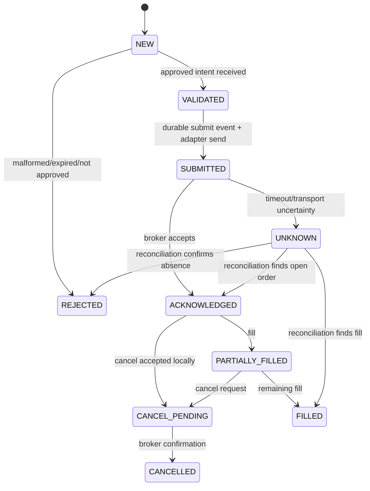

# Execution Specification

> **Owner:** Execution Platform
> **Status:** Active — v1.0
> **Last Review:** 2026-07-12
> **Decision Authority:** Execution Owner and Risk Owner
> **Depends On:** [SYSTEM_CONTRACTS.md](SYSTEM_CONTRACTS.md), [RISK_POLICY.md](RISK_POLICY.md), [ARCHITECTURE.md](ARCHITECTURE.md)
> **Supersedes:** None
> **Review Frequency:** Per broker/order-semantic change; monthly otherwise

## Normative path

`Strategy package → TradeIntent → deterministic risk decision → ApprovedOrderIntent → execution → broker acknowledgement/fill → portfolio projection → reconciliation`. Only the named owner may advance its state. This formalizes the selected execution/reconciliation design in `../ADOPTION_DECISIONS.md`; all messages conform to [SYSTEM_CONTRACTS.md](SYSTEM_CONTRACTS.md).

## Order state machine

`UNKNOWN` is an operational safety state, not permission to resubmit. It blocks duplicate economic action until broker truth is reconciled. Terminal event ordering is immutable; late events are recorded and applied through valid correction rules.

## Admission, timeout, and retry

An intent is rejected before routing when expired, duplicates an active/economic idempotency key, lacks an accepted unexpired risk decision, has stale market data, has invalid schema, or trading state is not `ACTIVE`. Persist `OrderSubmitted` before or atomically with an adapter request according to the adapter’s durable-outbox design. Adapter request timeouts and retry budgets are broker-specific configuration with bounded exponential backoff/jitter. Retrying uses the same client order id and checks broker idempotency support; otherwise transition to `UNKNOWN` and reconcile. Never retry a cancel/replace blindly after an ambiguous response.

## Failure handling

| Failure | Mandatory action |
|---|---|
| risk unavailable or stale | fail closed; reject new intent |
| broker auth/connectivity failure | stop routing to adapter; alert; reconcile on recovery |
| ambiguous submit/cancel/replace | mark `UNKNOWN`; query broker; no duplicate action |
| market-data staleness | reject new intent; evaluate active-order policy |
| fill/order sequence anomaly | persist raw report; quarantine projection; reconcile |
| restart | restore durable events, reconnect, reconcile before `ACTIVE` |
| material reconciliation drift | activate/maintain halt per risk policy |

## Fill, portfolio, and reconciliation

Broker reports are normalized at the adapter boundary, deduplicated by broker execution identity, persisted, and then applied to portfolio in deterministic sequence. Portfolio emits position/balance/exposure changes from facts; it does not trust strategy estimates. Reconcile at startup, periodically, after disconnect, before/after a halt release, and on any ambiguous order state. Differences have severity, source snapshots, owner, and resolution event. Material unresolved drift prevents activation or scale-up.

## Broker adapter contract

An adapter declares supported order types/TIF, idempotency semantics, precision, rate limits, auth lifecycle, session calendar, timeout/retry policy, status mapping, reconciliation endpoints, and error taxonomy. It maps external messages to canonical contracts without exposing SDK types. A new adapter requires contract fixtures, sandbox/paper validation, disconnect/restart tests, rate-limit tests, and an approval in [GOVERNANCE.md](GOVERNANCE.md).

