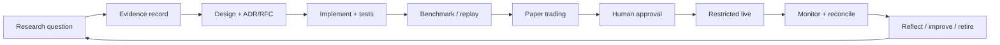

# Implementation Playbook

> **Owner:** Engineering Delivery
> **Status:** Active — v1.0
> **Last Review:** 2026-07-12
> **Decision Authority:** Engineering Leadership; Risk Owner for live gates
> **Depends On:** [GOVERNANCE.md](GOVERNANCE.md), [TESTING_STANDARD.md](TESTING_STANDARD.md), [RISK_POLICY.md](RISK_POLICY.md)
> **Supersedes:** None
> **Review Frequency:** Quarterly; after a material release incident

## Delivery lifecycle

## Phase gates

| Gate | Entry evidence | Exit evidence |
|---|---|---|
| Research | falsifiable question and source inventory | reproducible, graded evidence record |
| Design | clear boundary, alternatives, failure analysis | approved RFC/ADR and acceptance tests |
| Build | versioned contract and test plan | reviewed implementation; unit/integration tests pass |
| Validate | deterministic build artifact | replay, simulation, walk-forward/Monte Carlo, benchmark results |
| Paper | approved strategy package and limits | broker/session behavior, reconciliation, operational readiness |
| Restricted live | accountable human approval, rollback, on-call | bounded performance and zero unresolved critical control failures |
| Scale/retire | sustained evidence | explicit allocation change or retirement ADR |

## Required practice

Start every change by identifying its owner, affected state, authority boundary, sources of truth, failure modes, observability, and reversal. Develop in small increments. Test negative as well as successful paths. Compare performance-sensitive work to baseline. Keep immutable artifacts for code, configuration, datasets, strategy package, experiment, and deployment.

## Deployment and rollback

Deploy the identical signed/immutable artifact through isolated environments. Verify health, telemetry, risk decisions, broker connectivity, and reconciliation before enabling any strategy. Rollback means disable new intent admission, preserve facts, cancel/contain according to policy, restore a known compatible artifact/configuration, and reconcile; it never means deleting history or editing production state. A rollback plan is required before a live-impacting change starts.

## Production monitoring and reflection

Monitor SLOs, event lag, data freshness, risk rejections, broker errors, fill anomalies, reconciliation drift, storage health, and resource saturation. Post-incident and post-release reviews answer what happened, why controls behaved as they did, which evidence changed, and whether an ADR/risk/test/document update is needed. The Reflection loop may create research tasks; it cannot change live strategy or risk policy autonomously.

## Definition of done

A change is done when its tests and required gate evidence are recorded, dashboards and alerts are actionable, runbooks and documents are current, rollback is verified, approvals are captured, and no policy exception remains open. The staged direction aligns with `../IMPLEMENTATION_ROADMAP.md` but is constrained by the critical changes in `../HOSTILE_REVIEW.md`.
