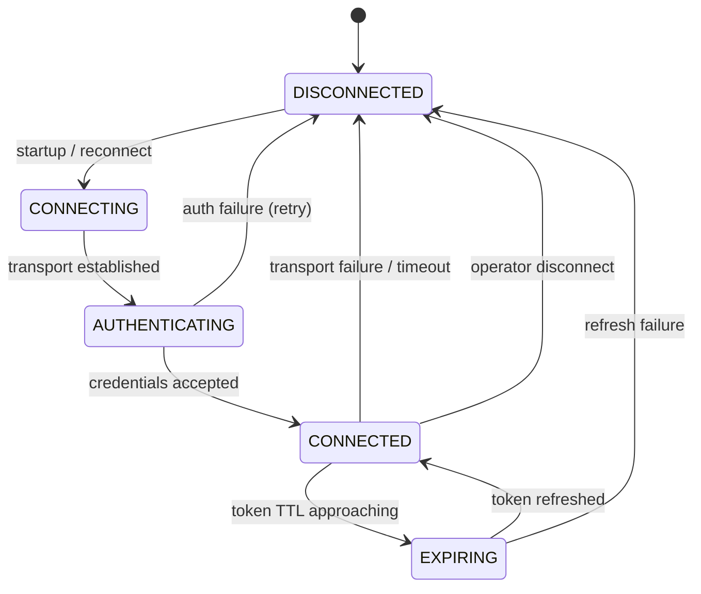

# Broker Specification

> **Owner:** Execution Platform
> **Status:** Active — Phase -1
> **Last Review:** 2026-07-13
> **Supersedes:** None
> **Implemented in:** Phase C (core/src/adapters.rs), Phase E (platform/adapters/)

## Purpose

Define the canonical typed broker adapter interface that all broker integrations implement. An adapter translates external broker protocols to/from TITAN contracts without leaking SDK objects beyond its boundary.

## Boundary / Ownership

Owns: Broker adapter trait, session lifecycle, credential isolation.
Delegates to: External broker API (via SDK or HTTP), Secret manager (credential references).
Called by: Execution engine (order lifecycle), Reconciliation engine (snapshots).

## Inputs

- `ApprovedOrderIntent` (from Execution)
- `CancelOrder`, `ReplaceOrder` commands (from Execution)
- `Reconcile` requests (from Reconciliation)
- `Heartbeat` requests (from health monitoring)

## Outputs

- `BrokerOrderAcknowledgement` (accept/reject + broker order id)
- `BrokerFill` (execution_id, qty, price, fees, currency)
- `BrokerOrderStatus` (current state per broker)
- `BrokerPositionSnapshot` (positions at a point in time)
- `BrokerBalanceSnapshot` (balances at a point in time)
- `AdapterHealth` (connectivity, auth expiry, degradation)
- `BrokerTruthSnapshot` (full state for reconciliation)

## Session lifecycle



## Adapter trait (canonical interface)

```rust
fn authenticate(credentials_ref: &str) -> Result<Session, AdapterError>;
fn refresh(session: &Session) -> Result<Session, AdapterError>;
fn place_order(intent: ApprovedOrderIntent) -> Result<BrokerOrderAcknowledgement, AdapterError>;
fn modify(order_id: BrokerOrderId, amendment: OrderAmendment) -> Result<BrokerOrderAcknowledgement, AdapterError>;
fn cancel(order_id: BrokerOrderId) -> Result<CancellationAcknowledgement, AdapterError>;
fn positions(account: AccountId) -> Result<BrokerPositionSnapshot, AdapterError>;
fn holdings(account: AccountId) -> Result<BrokerHoldingSnapshot, AdapterError>;
fn margin(account: AccountId) -> Result<MarginSnapshot, AdapterError>;
fn quotes(instruments: InstrumentSet) -> Result<QuoteSnapshot, AdapterError>;
fn orders(account: AccountId, window: QueryWindow) -> Result<BrokerOrderSnapshot, AdapterError>;
fn fills(account: AccountId, window: QueryWindow) -> Result<BrokerFillSnapshot, AdapterError>;
fn heartbeat() -> Result<AdapterHealth, AdapterError>;
fn reconcile(account: AccountId, cursor: ReconciliationCursor) -> Result<BrokerTruthSnapshot, AdapterError>;
```

Adapter SDK types never escape the adapter boundary. All return types are TITAN canonical types.

## Dependencies

- Money types (price, quantity)
- Security manager (credential references)
- (Optional) External broker SDK

## Error taxonomy

| Error | Classification | Recovery |
|---|---|---|
| Authentication failure | Retryable | Refresh credentials; retry |
| Rate limit exceeded | Retryable | Backoff and retry |
| Transport timeout | Operational (ambiguous) | Return timeout error; caller transitions to UNKNOWN |
| Transport unreachable | Operational | Transition to DISCONNECTED |
| Invalid order parameters | Terminal (data-quality) | Return rejection to caller |
| Unsupported capability | Terminal | Return typed rejection |

## Metrics

| Metric | Type | Labels |
|---|---|---|
| `broker.connected` | Gauge | adapter |
| `broker.auth_expiry_seconds` | Gauge | adapter |
| `broker.request_latency` | Histogram | adapter, method |
| `broker.request_errors` | Counter | adapter, method, error_type |
| `broker.rate_limit_remaining` | Gauge | adapter |

## Configuration

| Key | Type | Default | Description |
|---|---|---|---|
| `broker.<name>.api_url` | string | — | Broker API endpoint |
| `broker.<name>.rate_limit_per_second` | integer | 10 | Max requests per second |
| `broker.<name>.submit_timeout_ms` | integer | 5000 | Per-request timeout |
| `broker.<name>.credentials_ref` | string | — | Secret manager path |

## Performance budget

- Adapter round-trip (simulated): p99 <1 ms
- Adapter round-trip (real broker): depends on broker; measured in paper phase
- See `PERFORMANCE_SPEC.md`.

## Failure behavior

See `FAILURE_MATRIX.md`:
- Broker disconnect → halt routing
- Broker timeout → UNKNOWN → reconcile
- Authentication expiry → refresh or disconnect
