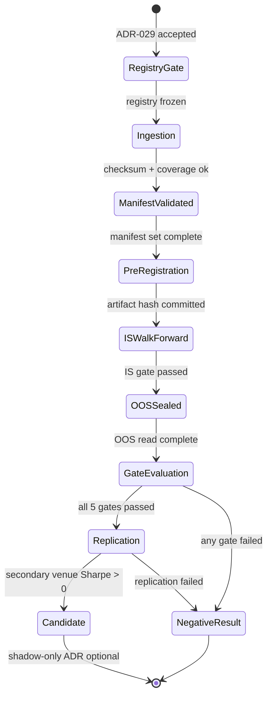

# CryptoResearch Specification

> **Owner:** Research Platform
> **Status:** Accepted (2026-08-14) with ADR-029. Implementation is research-only.
> **Date:** 2026-08-13
> **Depends on:** ADR-029, `research/crypto/CRYPTO_MARKET_STRUCTURE_CHARTER.md`, `docs/reference/BACKTEST_ENGINE.md`
> **Boundary:** research-only. This specification does not authorize an order, paper, credential, adapter, or certificate path.

## Purpose

Define the research-only crypto market-structure discovery subsystem: read-only ingestion with provenance, a venue-aware 24/7 cost simulator, and preregistered hypothesis screens that produce either one reproducible net-of-cost candidate (eligible for a future shadow-only proposal) or a documented negative result. A profitable result is not assumed.

## Scope and boundary

- In scope: BTC and ETH spot/perpetual market-structure data and the three preregistered hypotheses (funding/basis cross-section; funding + open-interest deleveraging; order-flow/liquidity imbalance).
- Out of scope: all other instruments, indicator-only variations of the retired FX OHLCV strategy families, parameter sweeps, exchange credentials, private API calls, exchange adapters, paper accounts, order submission, certificates, and live trading.
- The subsystem must not import, reference, or emit `TradeIntent`, `OrderRouter`, `BrokerAdapter`, `PaperSession`, `CertificateIssuer`, or any execution/credential-bearing name. A static import-boundary test enforces this.

## Boundary / Ownership

Owns: venue registry, source manifests, `CryptoMarketEvent` normalization, venue capability/cost snapshots, walk-forward artifacts, gate evaluation, evidence bundles, and negative-result records.

Delegates: nothing to broker or execution subsystems. Consumes only read-only local data files.

## Inputs

- Raw venue data files (read-only, local, checksum-validated against a committed manifest).
- Venue registry (frozen, content-addressed) — gate before any acquisition.
- Pre-registration artifact (frozen universe, signal, parameters, costs, partitions, pass/fail criteria).

## Outputs

- `CryptoMarketEvent` stream (normalized; no raw exchange payload reaches the simulator).
- Coverage, gap, sequence-validity, and point-in-time universe reports.
- Net PnL attribution evidence bundles and terminal status: `candidate` or `negative_result`.
- Frozen snapshots at each program gate.

## Canonical contracts

### CryptoMarketEvent

| Field | Type | Required | Notes |
|---|---|---|---|
| `event_id` | `str` | yes | content-hash of the raw record |
| `venue` | `str` | yes | registry `venue_id` |
| `symbol` | `str` | yes | normalized symbol |
| `contract_kind` | enum | yes | `SPOT` \| `PERPETUAL` |
| `occurred_at` | datetime | yes | UTC, nanoseconds, non-decreasing per `(venue, symbol)` |
| `sequence` | int64 | order-flow types | venue-native; required for `TRADE`, `L2_DELTA`, `L2_SNAPSHOT` |
| `event_type` | enum | yes | `TRADE` \| `QUOTE` \| `L2_SNAPSHOT` \| `L2_DELTA` \| `FUNDING` \| `OPEN_INTEREST` \| `MARK` \| `LIQUIDATION` |
| `price`, `qty`, `side` | decimal/enum | per type | `price`/`qty` required for `TRADE`; `bid`/`ask` for `QUOTE` |
| `funding_rate` | decimal | `FUNDING` | per-period, venue sign convention |
| `open_interest` | decimal | `OPEN_INTEREST` | base-asset units |
| `bid`, `ask`, `bid_qty`, `ask_qty`, `l2_levels` | decimal/list | `QUOTE`/L2 | top-of-book or L2 snapshot |
| `source_manifest_digest` | `str` | yes | must resolve to a committed manifest; orphans rejected |
| `ingestion_ts` | datetime | yes | UTC, nanoseconds |

Validation rules: out-of-tick prices are rejected, not snapped; duplicate or decreasing `sequence` is a hard reject for order-flow hypotheses (logged warning + drop otherwise); `occurred_at` regression is a hard reject with quarantine and gap log.

### Source manifest

Per dataset: venue, product/symbol, spot/perpetual contract specification, quote currency, tick/lot/min-notional precision, price and quantity precision (Decimal places), UTC timestamp semantics, source URL/licence, retrieval timestamp (UTC), checksum (SHA-256), data gaps/corrections log, coverage dates, point-in-time constituent history, funding rate/payment timestamps and convention, order-flow data type and sequence policy, inactive/delisted inclusion flag and delisting dates, manifest version, and parent manifest digest for corrections.

Minimum admissible data: 24 contiguous months, 24/7 coverage, documented outage/gap rate, point-in-time universe for cross-sectional work, and a frozen holdout segment never used for parameter choice.

### Venue registry

Per venue: venue_id, legal entity/operator, read-only endpoints, licence terms and URL, rate limits, symbol universe, quote currency, tick/lot/min-notional, fee schedule (maker/taker by tier), funding convention (cadence, timestamp semantics, sign), contract/margin definitions, latency estimate, venue-disconnect assumptions, data retention/provenance hash, retrieval timestamp, checksum. Frozen and content-addressed; any post-freeze change invalidates downstream results and requires re-registration.

## State machine

Terminal states are absorbing: no re-tuning, no parameter edit, no re-entry after a negative result for that hypothesis.

## Error taxonomy

| Error | Class | Recovery |
|---|---|---|
| Checksum mismatch | Data-quality | Reject dataset; quarantine |
| Non-UTC / `occurred_at` regression | Data-quality | Hard reject; gap logged |
| Missing/invalid `sequence` on order-flow types | Data-quality | Reject for order-flow hypotheses; drop + warn otherwise |
| Sequence gap > 3 median update intervals | Data-quality | Symbol invalidated for that UTC day (order-flow only) |
| Out-of-tick price or min-notional violation | Data-quality | Reject, not snap |
| Orphan event (unresolved manifest digest) | Data-quality | Reject |
| Registry change after freeze | Risk | Invalidate downstream results; require re-registration |
| Execution/credential name imported or present | Risk | Hard fail of boundary test; alert |
| Any gate failure (Sharpe, IC, concentration, capacity, replication) | Terminal | Negative-result record; hypothesis stops |
| Missing/miscomputed cost component found after OOS read | Terminal | Negative result for that hypothesis |

## Metrics

- Net PnL attribution, separate fields: price, funding, fees, spread, impact, borrow, failed/partial fills, latency rejections, currency conversion.
- Coverage gap rate per instrument; sequence-gap rate per `(venue, symbol)`.
- Per-window IC (Spearman, cross-sectional); concentration = max instrument share of cumulative net PnL; capacity curve (net Sharpe vs. fraction of 30d ADV) under the adverse scenario.
- Gate verdicts per hypothesis with the pre-registration hash binding each run.

## Configuration

All numeric parameters, thresholds, lookback windows, cost assumptions, participation caps, partition boundaries, and pass/fail criteria are frozen in the pre-registration artifact. No free or runtime-adjustable parameters exist. The artifact hash is recorded before OOS read; the simulator refuses an OOS run without a matching hash.

## Performance budget

Batch research pipeline, not real-time. Refer to `PERFORMANCE_SPEC.md` for ingestion/replay throughput line items; deterministic output is required (seeds pinned, sorted iteration on `(venue, symbol, occurred_at, sequence)`).

## Failure behavior

Refer to `FAILURE_MATRIX.md` for the research pipeline row. All failures preserve evidence: never delete manifests, artifacts, or negative results to obtain a pass. A bar-close constant-bps fill is exploratory only and can never qualify a candidate.

## Rollback

Stop research ingestion; retain immutable manifests, snapshots, and evidence bundles. This specification cannot be used to enable exchange credentials, orders, paper trading, or live trading; those require a separate accepted scope ADR, broker certification, and ADR-028 certificate controls.
