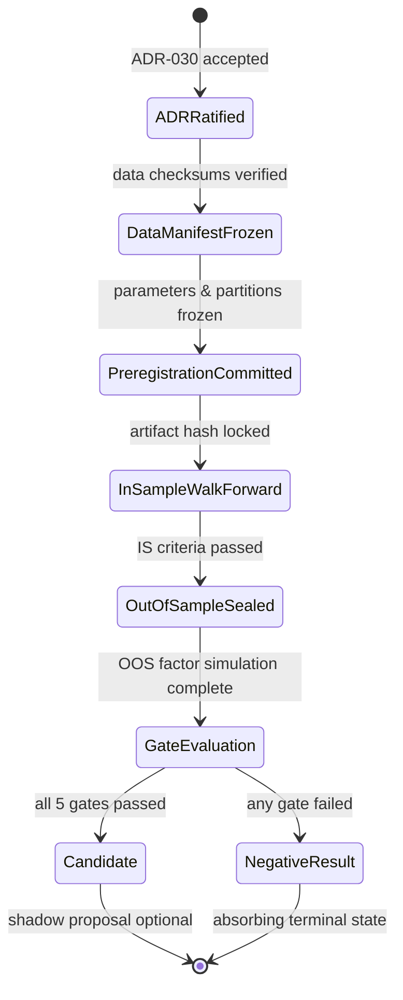

# EquitiesFactorResearch Specification

> **Owner:** Research Platform  
> **Status:** Proposed (2026-08-16) with ADR-030. Implementation is research-only.  
> **Depends on:** ADR-030, `research/equities/EQUITIES_FACTOR_CHARTER.md`, `specifications/Governance.spec.md`  
> **Boundary:** research-only. This specification does not authorize live orders, live credentials, or broker account access.

## Purpose

Define the research-only US Equities and ETFs Cross-Sectional Factor Discovery Subsystem: point-in-time multi-asset data loading, cross-sectional factor ranking engines, dollar-neutral portfolio weight generation, borrowing/commission cost simulation, and walk-forward factor gate evaluation.

## Scope and Boundary

- **In scope:** Liquid US Equities and Sector ETFs; point-in-time split/dividend adjusted price matrix; cross-sectional factor models (`EQ-001`, `EQ-002`, `EQ-003`); dollar-neutral quantile spread simulation; factor attribution reporting.
- **Out of scope:** Single-asset directional indicator optimization, automated live order execution, live exchange/broker API keys, execution certificates.
- **Boundary rule:** The factor research subsystem must not import `OrderRouter`, `BrokerAdapter`, or `PaperTradingEngine`. A static import-boundary test enforces this.

## Inputs

- Multi-asset point-in-time daily bar matrices (clean, verified against committed manifests).
- Point-in-time universe selection: S&P 500 membership, market capitalization, 90-day ADV, and Easy-to-Borrow (ETB) status sourced strictly as of the inception date (e.g. 2020-01-02). Delistings, acquisitions, and borrow changes are modeled as explicit historical events.
- Factor pre-registration definitions (`EQ-00X-prereg.json`) containing lookbacks, quantiles, rebalance frequency, gross exposure, and pass criteria.
- Cost configuration: IBKR commission tier ($0.005/share), 1.0 bps spread, 0.5 bps execution slippage impact, and 50 bps annualized short borrow rate.

## Outputs

- Cross-sectional factor rankings and score matrices.
- Dollar-neutral target weight vectors per rebalance date $\mathbf{w}_t \in \mathbb{R}^N$ where $\sum w_{i,t}^+ = \frac{G}{2}$, $\sum w_{i,t}^- = -\frac{G}{2}$, and $\sum w_{i,t} = 0.0$ (where $G$ is declared gross exposure, e.g. $G=2.0$ for $+100\%$ long / $-100\%$ short, or $G=1.0$ for $+50\%$ long / $-50\%$ short).
- Monotonicity test across all 10 Deciles ($D_1 > D_2 > \dots > D_{10}$) for 50-stock universes, where each decile contains 5 stocks, Long target is $D_1+D_2$ (Bottom 10 Laggards), and Short target is $D_9+D_{10}$ (Top 10 Leaders).
- Detailed attribution bundles (`gross_pnl`, `long_leg_pnl`, `short_leg_pnl`, `short_borrow_cost`, `commissions`, `spread_cost`, `slippage_cost`, `turnover_rate`, `rank_ic_series`, `quantile_spreads`, `net_pnl`, `net_sharpe`, `max_drawdown`).
- Frozen evidence bundle: `research/equities/results/EQ-00X-evidence-bundle.json`.

## Core Data Structures & Interfaces

### 1. FactorManifest
Dataset manifest registering universe constituents, date ranges, adjusted price hashes, fee schedules (commissions, spread, slippage, short borrow), and IS/OOS boundary partitions.

### 2. FactorScoreMatrix
$T \times N$ matrix of point-in-time z-scored or percentile factor scores $z_{i,t} = \frac{f_{i,t} - \mu_{t}}{\sigma_t}$.

### 3. FactorWeights
$T \times N$ weight allocations satisfying:
$$\sum_{i=1}^N w_{i,t} = 0, \quad \sum_{i=1}^N |w_{i,t}| = G \quad (G \in \{1.0, 2.0\})$$

### 4. FactorAttribution
PnL and performance decomposition:
$$\text{Net PnL}_t = \text{Long PnL}_t + \text{Short PnL}_t - \text{Commissions}_t - \text{Spread}_t - \text{Slippage}_t - \text{Borrow Fee}_t$$

## State Machine

## Error Taxonomy

| Error | Class | Mitigation |
|---|---|---|
| Non-neutral dollar exposure ($|\sum w_i| > 10^{-6}$) | Model-Invariant | Hard rejection and normalization failure |
| Look-ahead bias (using future corporate actions) | Data-Quality | Enforce point-in-time split/dividend adjustment |
| OOS parameter modification | Governance | Hash-locked pre-registration verification |
| Negative borrow fee or zero commission calculation | Simulation | Assert all cost components strictly positive |

## Rollback & Auditability

All manifests, preregistrations, and evidence bundles are immutable and content-addressed. Negative results are permanently recorded to prevent hypothesis duplication.
