# Execution Specification

> **Owner:** Execution Platform
> **Status:** Active — Phase -1
> **Last Review:** 2026-07-13
> **Supersedes:** None
> **Implemented in:** Phase C (core/src/ + platform/execution/)

## Purpose

Route approved order intents to broker adapters, manage the order lifecycle, enforce timeouts and retry budgets, and produce the event stream that portfolio and reconciliation consume.

## Boundary / Ownership

Owns: Approved order dispatch, adapter orchestration, timeout/retry policy, UNKNOWN state transitions.
Delegates to: Order state machine (state tracking), Broker adapter (external communication), Event store (persistence).
Called by: Risk gate (receives ApprovedOrderIntent), Reconciliation (query in-flight orders).

## Inputs

- `ApprovedOrderIntent` (from Risk gate)
- Broker adapter responses (acknowledgement, fill, reject, timeout)
- Reconciliation queries
- Operator cancel/replace commands

## Outputs

- Order lifecycle events (via Order state machine)
- `OrderSubmitRejected` if the order cannot be submitted (adapter down, timeout)

## State machine

See `Order.spec.md` for the order state machine. Execution is the service that drives it.

Execution-specific states for the adapter submission:

```mermaid
stateDiagram-v2
  [*] --> PERSISTING: ApprovedOrderIntent received
  PERSISTING --> SENDING: OrderSubmitted event persisted
  SENDING --> WAITING: adapter request sent
  SENDING --> STORE_FAILURE: event store unavailable
  WAITING --> ACKNOWLEDGED: adapter returns success
  WAITING --> UNKNOWN: timeout / ambiguous response
  WAITING --> REJECTED: adapter returns rejection
  STORE_FAILURE --> [*]: fail; no submit
```

## Dependencies

- Event store (persist OrderSubmitted before or atomically with adapter request)
- Order state machine (all state transitions)
- Broker adapter trait (defined in `Broker.spec.md`)
- Clock (timeout evaluation)

## Error taxonomy

| Error | Classification | Recovery |
|---|---|---|
| Event store unavailable before submit | Terminal for this order | Reject; do not send to adapter |
| Adapter timeout | Retryable (with idempotency) | Mark UNKNOWN; reconcile |
| Adapter ambiguous response | Operational | Mark UNKNOWN; reconcile |
| Adapter unreachable | Operational | Halt routing to adapter |
| Rate limit exceeded | Retryable | Backoff and retry |

## Metrics

| Metric | Type | Labels |
|---|---|---|
| `execution.intent_to_submit_duration` | Histogram | adapter |
| `execution.submit_to_ack_duration` | Histogram | adapter |
| `execution.orders_unknown` | Gauge | adapter |
| `execution.adapter_errors` | Counter | adapter, error_type |
| `execution.retries` | Counter | adapter |

## Configuration

| Key | Type | Default | Description |
|---|---|---|---|
| `execution.submit_timeout_ms` | integer | 5000 | Per-submit timeout (ms) |
| `execution.max_retries` | integer | 3 | Max retries for retryable errors |
| `execution.retry_backoff_base_ms` | integer | 200 | Exponential backoff base (ms) |

## Performance budget

- Intent → OrderSubmitted event persisted: p99 <100 μs
- See `PERFORMANCE_SPEC.md`.

## Failure behavior

See `FAILURE_MATRIX.md`:
- Broker timeout (submit) → UNKNOWN → reconcile
- Broker timeout (cancel) → UNKNOWN → reconcile
- Broker disconnect → halt routing to adapter
