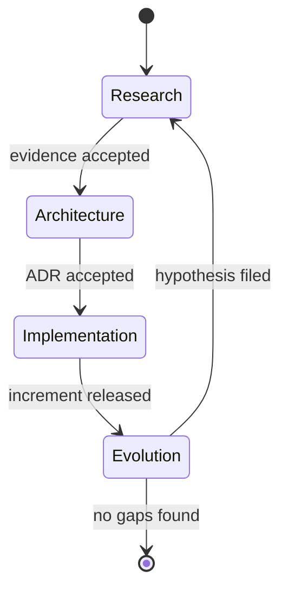

# Governance Specification

> **Owner:** Architecture Council
> **Status:** Active — ADR-016
> **Last Review:** 2026-07-20
> **Depends On:** OPERATING_PRINCIPLES.md, AGENTS.md, ADR.md

## Purpose

Ensure TITAN operates as a closed-loop learning system by formalizing the four continuous governance loops — Research, Architecture, Implementation, Evolution — their triggers, inputs, outputs, state machine, and metrics. The governance loop prevents drift between evidence, decisions, implementation, and operational reality.

## Boundary / Ownership

Owns: Loop definitions, artifact lifecycle (evidence → ADR → spec → increment → hypothesis), cycle-time metrics, stalled-plan tracking.
Delegates to: Individual ADRs and subsystem specs for domain-specific content; `OPERATING_PRINCIPLES.md` for loop process steps; `AGENTS.md` for decision classification and the implementation gate.

## Inputs

- Research artifacts (evidence records, reproducible results)
- Incident records and post-mortems
- Post-trade reflections and reconciliation reports
- Gap analyses and improvement hypotheses (from Evolution loop)
- External R&D evidence base entries

## Outputs

- New/updated ADRs (Architecture loop)
- New/updated specifications (Architecture loop, via ADR)
- New plan documents (Architecture loop)
- Tested, observable, reversible code increments (Implementation loop)
- Ranked improvement hypotheses and gap analyses (Evolution loop)

## State machine

Transitions:
| From | To | Trigger | Gate |
|---|---|---|---|
| Research | Architecture | evidence peer-reviewed and stored | evidence is reproducible and challenges documented |
| Architecture | Implementation | ADR accepted per ADR.md | ADR has context, evidence, decision, alternatives, consequences, validation |
| Implementation | Evolution | increment released to target environment | all six conditions of AGENTS.md:47-55 are met |
| Evolution | Research | improvement hypothesis filed | hypothesis is ranked and has measurable acceptance criterion |
| Evolution | [*] | no actionable gaps identified | Architecture Council confirms no open hypotheses |

## Dependencies

| Subsystem | Relationship |
|---|---|
| OPERATING_PRINCIPLES.md | Defines the permanent cycle and required output for each loop |
| AGENTS.md | Defines decision framework (classification by loop) and implementation gate conditions |
| ADR.md | Defines ADR template, status values, and acceptance policy |
| Evidence base (R&D) | Stores Research loop outputs; consumed by Architecture loop |

## Error taxonomy

| Error | Classification | Recovery |
|---|---|---|
| Loop skipped (e.g., implementation without ADR) | Governance | Reject change; require retrospective ADR |
| ADR accepted without evidence | Governance | Reject ADR; return to Research |
| Implementation without accepted spec | Governance | Block release; require spec acceptance per ADR-0001 |
| Stalled plan (no activity > max_plan_age) | Operational | Flag for Architecture Council review |
| Evolution hypothesis filed without ranking | Data-quality | Reject hypothesis; require priority score |
| Cycle time exceeds alert threshold | Operational | Log; alert Architecture Council |

## Metrics

| Metric | Type | Semantic |
|---|---|---|
| `governance.loop.research.cycle_time` | Histogram (seconds) | Time from hypothesis acceptance to evidence stored |
| `governance.loop.architecture.cycle_time` | Histogram (seconds) | Time from evidence accepted to ADR accepted |
| `governance.loop.implementation.cycle_time` | Histogram (seconds) | Time from ADR accepted to increment released |
| `governance.loop.evolution.cycle_time` | Histogram (seconds) | Time from increment released to hypothesis filed |
| `governance.loop.total.cycle_time` | Histogram (seconds) | Full Research→Evolution cycle duration |
| `governance.artifact.age_days` | Gauge | Days since last revision per ADR and spec |
| `governance.stalled_plans` | Gauge | Count of plans exceeding max_plan_age without activity |

## Configuration

| Key | Type | Default | Validation |
|---|---|---|---|
| `governance.max_plan_age_days` | integer | 90 | Must be > 0 |
| `governance.required_approvers.research` | string[] | ["Architecture Council"] | Non-empty |
| `governance.required_approvers.architecture` | string[] | ["Architecture Council", "Risk Owner"] | Non-empty |
| `governance.required_approvers.implementation` | string[] | ["Architecture Council", "Risk Owner"] | Non-empty |
| `governance.required_approvers.evolution` | string[] | ["Architecture Council"] | Non-empty |
| `governance.alert_cycle_time_seconds` | integer | 2592000 (30 days) | Must be > 0 |

## Performance budget

Not applicable — governance is a human-process concern with no runtime performance requirement. Cycle-time budgets are set via `governance.alert_cycle_time_seconds`.

## Failure behavior

| Failure | Behavior | Recovery | Verification |
|---|---|---|---|
| Loop violation (skip) | Change rejected; incident record filed | Retrospective ADR or spec | Re-review at next Architecture loop |
| Stalled plan (> max_plan_age) | Plan flagged; Architecture Council notified | Council reviews and either closes or re-prioritizes | Metric drops to 0 |
| Missing artifact (ADR/spec) | Implementation blocked at CI gate | Author creates artifact per template | CI passes |
| Cycle-time alert | Architecture Council notified | Council triages and resolves blockers | Cycle-time drops below threshold |
