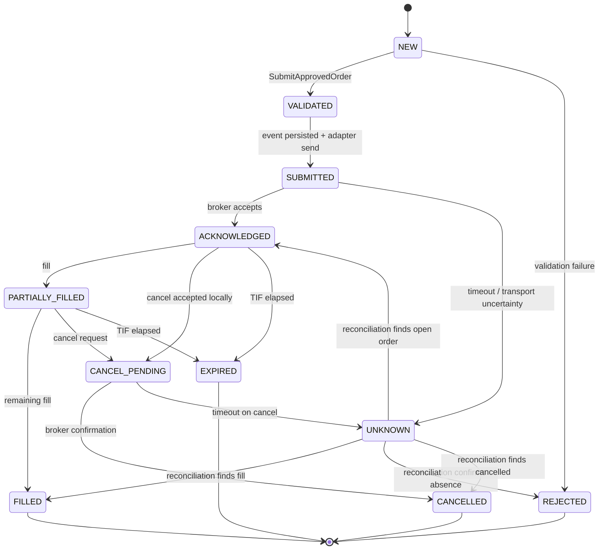

# Order Specification

> **Owner:** Execution Platform
> **Status:** Active — Phase -1
> **Last Review:** 2026-07-13
> **Supersedes:** None
> **Implemented in:** Phase B (core/src/orders.rs)

## Purpose

Provide the deterministic order state machine that tracks every order from creation through terminal state. Prevents illegal transitions, ensures idempotency, and enforces the UNKNOWN safety state.

## Boundary / Ownership

Owns: Order aggregate — state, lifecycle, idempotency keys.
Delegates to: Event store (persistence), Execution service (adapter dispatch).
Called by: Execution service, Reconciliation engine, Portfolio projection (read-only).

## Inputs

- `SubmitApprovedOrder` (from Risk → Execution)
- `CancelOrder`, `ReplaceOrder` (from Execution service)
- Broker acknowledgements, fills, rejects (from adapter)
- Reconciliation snapshots (from Reconciliation engine)

## Outputs

- `OrderValidated`, `OrderSubmitted`, `OrderAcknowledged`, `OrderPartiallyFilled`, `OrderFilled`, `OrderRejected`, `OrderCancelled`, `OrderExpired` events

## Commands

| Command | Source | Valid states |
|---|---|---|
| `SubmitApprovedOrder(id, intent)` | Risk gate | NEW |
| `RecordBrokerAck(id, broker_order_id)` | Adapter | SUBMITTED |
| `RecordFill(id, execution_id, qty, price)` | Adapter | ACKNOWLEDGED, PARTIALLY_FILLED |
| `RecordReject(id, reason_code)` | Adapter, Validation | NEW, VALIDATED, SUBMITTED, ACKNOWLEDGED |
| `CancelOrder(id)` | Operator, Strategy, Risk | ACKNOWLEDGED, PARTIALLY_FILLED |
| `RecordCancel(id)` | Adapter | CANCEL_PENDING |
| `RecordExpiry(id)` | Clock | ACKNOWLEDGED, PARTIALLY_FILLED |
| `MarkUnknown(id)` | Execution (timeout) | SUBMITTED, CANCEL_PENDING |
| `ReconcileUnknown(id, broker_state)` | Reconciliation | UNKNOWN |

## Events

| Event | Meaning |
|---|---|
| `OrderValidated` | Intent passed local validation, being prepared for submission |
| `OrderSubmitted` | Event persisted before or atomically with adapter dispatch |
| `OrderAcknowledged` | Adapter confirmed broker accepted the order |
| `OrderPartiallyFilled` | Broker reported a partial fill |
| `OrderFilled` | Remaining quantity filled |
| `OrderRejected` | Broker or validation rejected the order |
| `OrderCancelled` | Broker confirmed cancellation |
| `OrderExpired` | Time-in-force elapsed without full fill |
| `OrderStateChanged` | Generic state transition notification |

## State machine

`UNKNOWN` is an operational safety state, not permission to resubmit. It blocks duplicate economic action until broker truth is reconciled.

## Dependencies

- Event store (persist events, replay aggregate)
- Money types (price, quantity, notional)
- Clock (expiry evaluation)

## Error taxonomy

| Error | Classification | Recovery |
|---|---|---|
| Illegal state transition | Terminal (bug) | Reject command; alert developer |
| Duplicate message_id | Retryable | No-op on replay; reject new with same id |
| Unknown order_id | Operational | Reject command; return error to caller |
| Invalid fill (exceeds remaining qty) | Terminal (data integrity) | Reject fill; quarantine; reconcile |

## Metrics

| Metric | Type | Labels |
|---|---|---|
| `orders.created` | Counter | side, instrument |
| `orders.filled` | Counter | side, instrument |
| `orders.rejected` | Counter | reason_code |
| `orders.cancelled` | Counter | reason |
| `orders.unknown` | Counter | trigger (timeout, cancel_timeout) |
| `orders.active` | Gauge | — |
| `orders.state_transition_duration` | Histogram | from_state, to_state |

## Configuration

Order-level limits are owned by Risk spec. Order service configuration:

| Key | Type | Default | Description |
|---|---|---|---|
| `order.idempotency_key_ttl` | duration | 24h | How long to retain idempotency keys after terminal state |
| `order.max_active_per_strategy` | integer | 100 | Per-strategy active order limit |

## Performance budget

See `PERFORMANCE_SPEC.md`:
- State transition validation: p99 <5 μs
- Event emission + persist: p99 <1 ms (shared with event store)

## Failure behavior

| Failure | Expected behavior |
|---|---|
| Duplicate message_id | No-op; return success (idempotent safe) |
| Illegal transition | Return error; do not persist event |
| Event store unavailable | Command fails; order state unchanged |
| UNKNOWN after timeout | Persist UNKNOWN event; reconcile via FAILURE_MATRIX.md |

See `FAILURE_MATRIX.md` for broker/adapter-level failures.
