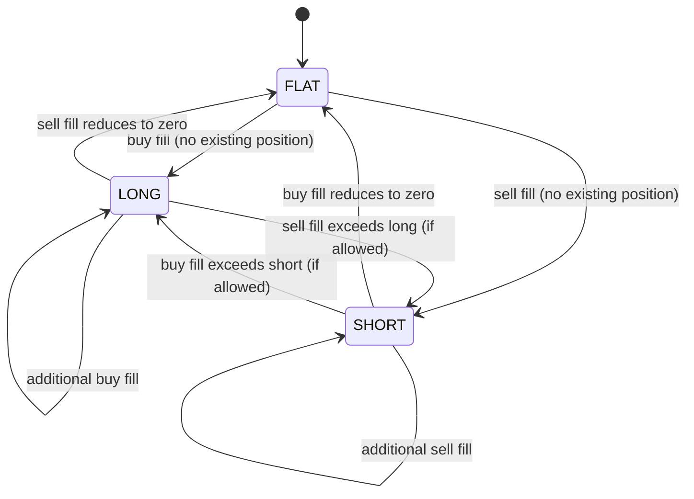

# Portfolio Specification

> **Owner:** Portfolio and Risk Engineering
> **Status:** Active — Phase -1
> **Last Review:** 2026-07-13
> **Supersedes:** None
> **Implemented in:** Phase C (core/src/portfolio.rs)

## Purpose

Provide the deterministic, event-driven projection of approved fills, cash movements, valuations, and corporate actions. It owns internal position, cash, PnL, exposure, and margin views. It never accepts direct strategy writes.

## Boundary / Ownership

Owns: Positions, cash balances, realized/unrealized PnL, exposure, margin, valuations.
Delegates to: Event store (source of fill/corporate-action events).
Called by: Risk engine (position/exposure for pre-trade checks), Reconciliation engine (internal truth for drift comparison), Reporting.

## Inputs

- `OrderFilled` events (from Execution)
- `CorporateAction` events (split, dividend, symbol change, merger)
- `CashMovement` events (fee, tax, financing, deposit, withdrawal)
- FX rate snapshots (for multi-currency valuation)
- Valuation price snapshots (mark-to-market)

## Outputs

- `PositionChanged` event (position opened, increased, decreased, closed)
- `BalanceChanged` event (cash balance updated)
- `ExposureChanged` event (gross/net/sector exposure updated)
- `PnLCalculated` event (realized/unrealized PnL computed)

## State machine

### Position lifecycle

Position is keyed by (account, instrument, lot where applicable, currency).

## Dependencies

- Event store (read OrderFilled, CorporateAction events)
- Money types
- For multi-currency: FX rate provider (simple configurable feed for MVP)

## Error taxonomy

| Error | Classification | Recovery |
|---|---|---|
| Duplicate fill application | Operational | No-op (idempotent by execution_id) |
| Fill order sequence violation | Terminal | Quarantine; reconcile |
| Unmatched corporate action | Operational | Skip; alert for manual review |
| FX rate unavailable | Operational | Use last known rate; flag staleness |

## Metrics

| Metric | Type | Labels |
|---|---|---|
| `portfolio.positions` | Gauge | instrument, side |
| `portfolio.gross_exposure` | Gauge | instrument, currency |
| `portfolio.net_exposure` | Gauge | currency |
| `portfolio.unrealized_pnl` | Gauge | instrument, currency |
| `portfolio.realized_pnl` | Gauge | instrument, currency |
| `portfolio.cash_balance` | Gauge | currency |
| `portfolio.margin_used` | Gauge | currency |

## Configuration

| Key | Type | Default | Description |
|---|---|---|---|
| `portfolio.base_currency` | string | "USD" | Base currency for PnL reporting |
| `portfolio.valuation_price_source` | string | "last_trade" | Price source for mark-to-market |

## Performance budget

- Fill application (position + cash + PnL): p99 <50 μs
- Exposure recalculation: p99 <100 μs
- See `PERFORMANCE_SPEC.md`.

## Failure behavior

See `FAILURE_MATRIX.md`:
- Duplicate fill → idempotent no-op
- Fill order anomaly → quarantine, reconcile
