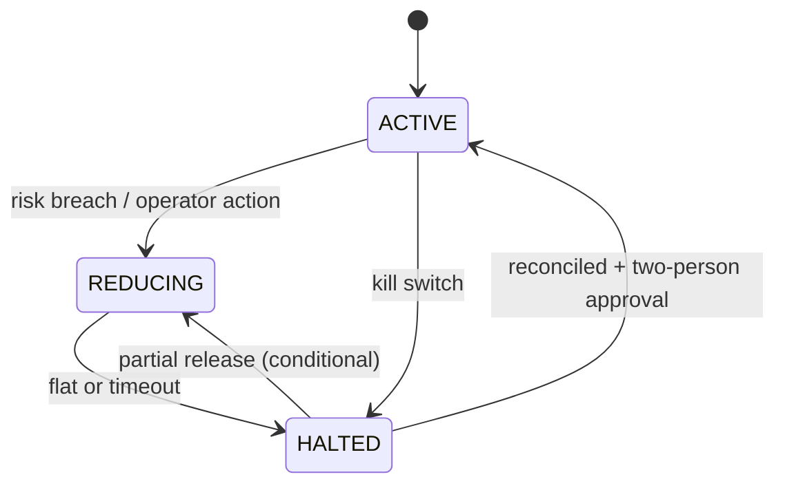
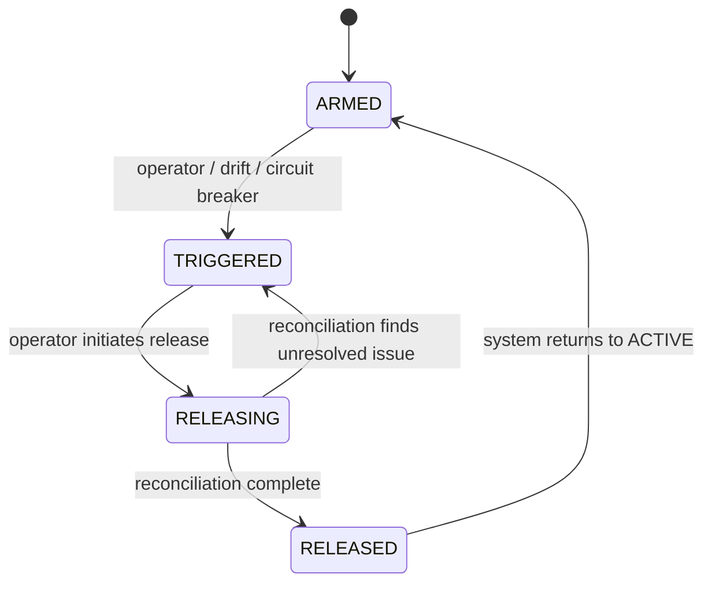

# Risk Specification

> **Owner:** Chief Risk Office
> **Status:** Active — Phase -1
> **Last Review:** 2026-07-13
> **Supersedes:** None
> **Implemented in:** Phase C (core/src/risk.rs)

## Purpose

Provide a deterministic, independently owned veto function that evaluates every TradeIntent against configured limits and state before an order may be submitted. No AI component, strategy, or operator shortcut may bypass it.

## Boundary / Ownership

Owns: Risk gate pipeline, limit store, kill switch, trading state (ACTIVE/REDUCING/HALTED).
Delegates to: Event store (persist decisions, limit changes).
Called by: Strategy runtime (sends TradeIntent), Operator (limit changes, kill-switch commands).

## Inputs

- `TradeIntent` (from Strategy runtime)
- Configuration: limits, eligibility, kill-switch policy
- Operator commands: update limit, trigger kill switch, release halt
- State signals: market data freshness, broker health, reconciliation drift

## Outputs

- `RiskDecision` (accepted/rejected + reason codes + rule versions)
- `KillSwitchActivated`, `TradingStateChanged` events
- `LimitBreached` event (when a limit is hit during active-order recheck)

## Risk pipeline (evaluation order)

```text
TradeIntent → schema/integrity → certificate validation (certificate_ref present and signed) → strategy eligibility →
market-data freshness → order limits (price/qty/notional/rate) →
position/exposure → portfolio/drawdown → liquidity/impact →
broker/session health → ApprovedOrderIntent or Rejected
```

Each check is a typed rule with version, input digest, and reason code. The pipeline short-circuits on first rejection. All decisions are persisted.

## State machines

### Trading state



- `ACTIVE`: normal operation, new intents accepted.
- `REDUCING`: only reduction-only intents accepted; position-reducing orders only.
- `HALTED`: no new intents accepted; open orders may be cancelled per policy.

### Kill switch



- `ARMED`: monitoring, ready to trigger.
- `TRIGGERED`: active — blocks all routing, cancels orders per policy.
- `RELEASING`: reconciliation in progress after trigger.
- `RELEASED`: trigger condition resolved, waiting for trading state transition.
- Kill switch never auto-resets. Release from TRIGGERED requires operator action.

## Dependencies

- Event store (persist RiskDecision, LimitBreached, KillSwitchActivated, TradingStateChanged)
- Portfolio engine (position/exposure/drawdown data)
- Money types (price, quantity, notional)
- Clock (data freshness evaluation)

## Error taxonomy

| Error | Classification | Recovery |
|---|---|---|
| Risk state unavailable (store down) | Operational | Fail closed (reject all intents); halt |
| Limit configuration invalid | Terminal (deploy error) | Fail to start; reject reload |
| Kill-switch state unreadable | Operational | Start in HALTED; alert |
| Market data freshness unknown | Operational | Reject intents for affected instruments |
| Certificate invalid or absent | Security | Reject intent (Unauthorized); alert |
| Sizing conversion data missing | Operational | Reject intent; await fresh rates |

## Metrics

| Metric | Type | Labels |
|---|---|---|
| `risk.decision_latency` | Histogram | — |
| `risk.intents_evaluated` | Counter | result (accepted/rejected) |
| `risk.intents_rejected` | Counter | reason_code |
| `risk.limit_breaches` | Counter | limit_name |
| `risk.kill_switch_state` | Gauge | 0=ARMED, 1=TRIGGERED, 2=RELEASING, 3=RELEASED |
| `risk.trading_state` | Gauge | 0=ACTIVE, 1=REDUCING, 2=HALTED |

## Configuration

| Key | Type | Default | Description |
|---|---|---|---|
| `risk.instrument_eligibility` | list[string] | [] | Eligible instrument IDs |
| `risk.max_order_notional` | string (decimal) | "1000000" | Max notional per order |
| `risk.max_order_quantity` | integer | 10000 | Max quantity per order |
| `risk.max_position_size` | integer | 50000 | Max position per instrument |
| `risk.max_gross_exposure` | string (decimal) | "10000000" | Max gross exposure |
| `risk.max_drawdown_fraction` | float | 0.10 | Max drawdown (10%) |
| `risk.max_daily_loss` | string (decimal) | "50000" | Max daily realized loss |
| `risk.data_freshness_threshold_ms` | integer | 5000 | Max age of market data |

## Performance budget

- Single intent evaluation (full pipeline): p99 <50 μs
- Kill-switch state check: p99 <10 μs
- See `PERFORMANCE_SPEC.md`.

## Failure behavior

See `FAILURE_MATRIX.md`:
- Risk unavailable → fail closed
- Kill-switch trigger → immediate halt
- Limit breach → reject or reduce/halt
