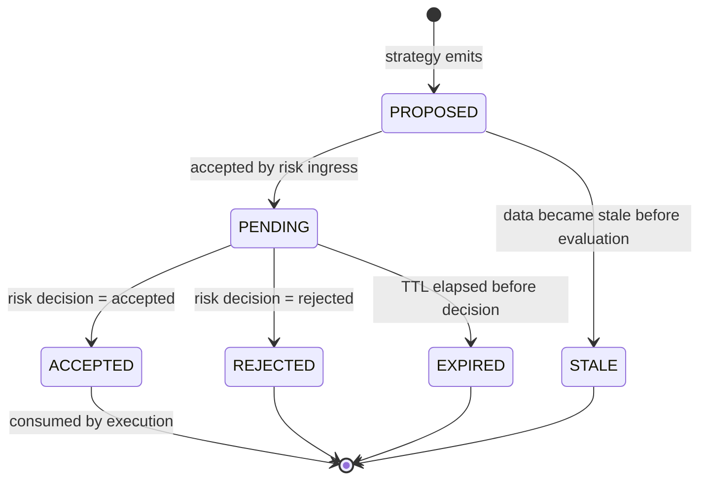

# TradeIntent Specification

> **Owner:** Strategy Runtime
> **Status:** Active — Phase -1
> **Last Review:** 2026-07-13
> **Supersedes:** None
> **Implemented in:** Phase B (core/src/messages.rs)

## Purpose

Define the canonical typed intent that a strategy may emit. TradeIntent is the only message type that bridges strategy logic and deterministic risk. It is never a broker order.

## Boundary / Ownership

Owns: TradeIntent schema, validation rules, provenance chain.
Delegates to: Risk gate (evaluation).
Called by: Strategy runtime, Research engine (advisory proposals only).

## Inputs

- Strategy package digest, parameter snapshot, and market/feature state
- `ExecutionCertificateRef(certificate_id, content_digest)` (mandatory for live/paper execution)

## Outputs

- `TradeIntent` messages to the risk gate
- `TradeIntentExpired` events (when an intent's time-to-live elapses without a decision)

### Exit fields (ADR-021)

A `TradeIntent` may carry optional, broker-agnostic protective exits, all in
absolute price terms (no strategy-side assumption about broker mechanics):

| Field | Meaning | Validation |
|---|---|---|
| `certificate_ref` | cryptographic execution authority | must match valid loaded promotion certificate |
| `stop_price` | Initial protective stop (loss side) | optional decimal string |
| `take_profit_price` | Initial profit target | optional decimal string |
| `trailing` | Trailing controller `(activation_distance, trail_distance)` | `activation >= trail` (strict `ValueError`, code `trailing_activation_less_than_distance`) |

Producer responsibility: the strategy emits signal + exit levels (e.g. ATR ×
multiple); the bridge attaches them to the intent; the engine/adapter owns
trailing persistence and broker mapping. `ApprovedOrderIntent` carries
`stop_price` today; `take_profit_price` / `trailing` require the Rust
`ApprovedOrderIntent` extension (ADR-021 follow-up) before they survive the
approval boundary to the IBKR adapter.

## State machine

## Dependencies

- Money types (price, quantity)
- Strategy package digest (validated package identity)

## Error taxonomy

| Error | Classification | Recovery |
|---|---|---|
| Missing required field | Data-quality | Reject at ingress |
| Invalid strategy digest | Security | Reject; alert |
| Invalid/Missing Certificate | Security | Reject; alert (engine layer) |
| Stale market data reference | Operational | Reject; strategy must retry with fresh data |
| Expired intent | Operational | No-op; caller must submit new intent |
| Duplicate intent idempotency key | Operational | No-op (if same payload) or error (if different) |

## Metrics

| Metric | Type | Labels |
|---|---|---|
| `intent.proposed` | Counter | strategy_id |
| `intent.accepted` | Counter | strategy_id |
| `intent.rejected` | Counter | strategy_id, reason_code |
| `intent.expired` | Counter | strategy_id |

## Configuration

| Key | Type | Default | Description |
|---|---|---|---|
| `intent.default_ttl` | duration | 5s | Default time-to-live for an intent |
| `intent.max_ttl` | duration | 60s | Maximum allowed TTL |

## Performance budget

- Validation: p99 <5 μs
- See `PERFORMANCE_SPEC.md` (validation is part of risk-gate budget).

## Decision trace requirements

Every TradeIntent emitted by a validated proposal must produce an append-only log through the following stages:

| Stage | Source | Content |
|---|---|---|
| MarketEventReceived | RuntimeEvaluator | event message_id, event_type, instrument_id |
| FeatureSnapshotCreated | RuntimeEvaluator | timeframe, feature_count |
| StrategyEvaluated | RuntimeEvaluator | strategy_ids evaluated |
| TradeProposalCreated | RuntimeEvaluator | proposal_id(s) |
| ProposalValidated | RuntimeEvaluator | validation status |
| RiskDecision | PaperTradingEngine | verdict accepted/rejected, reason |
| ApprovedOrderIntent | PaperTradingEngine | risk_decision_id, client_order_id |
| BrokerAcknowledgement | PaperTradingEngine | broker_order_id, accepted |

All stages share a `correlation_id` that links the originating MarketEvent through to the broker acknowledgement. The trace is stored as EventEnvelope records with `aggregate_type="DecisionTrace"` in the EventStore.

## Failure behavior

Stale data and expired intent are normal operational outcomes, not errors. See `FAILURE_MATRIX.md`.
